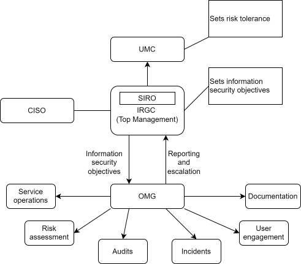
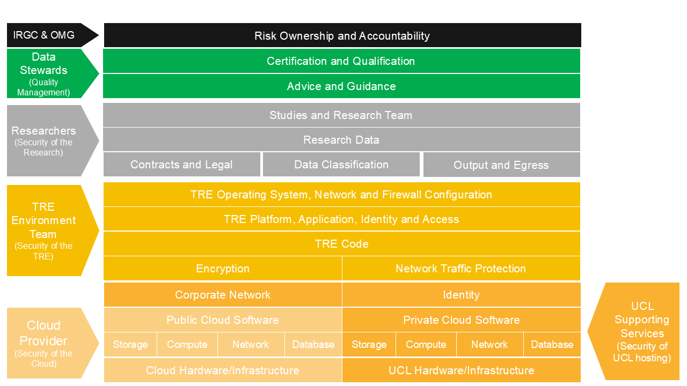



<!-- isms:begin id=overview -->

## Document Overview {#sec-overview}

This document establishes the framework for defining roles, responsibilities, and authorities within
the   (’the ’). It also outlines
our approach to providing those roles with appropriate resources, ensuring the competence of the
persons assigned to those roles, and promoting awareness of information security throughout the
organisation.

This document also outlines the framework for identifying the necessary resources and competencies
required for each of the above groups, ensuring they can establish, implement, maintain and
continuously improve the 

This document covers:

- [Scope of the roles and responsibility](#sec-scope)
- [The information governance framework](#sec-framework)
- [How resources are allocated](#sec-resources)
- [Competencies expected](#sec-competence)
- [The Shared responsibility Model](#sec-model)
- [Approved researcher, study and project roles](#sec-roles)
- [Complete roles catalogue](#sec-roles-catalogue)

**This document addresses the following requirements in the ISO 27001:2022 standard:**

- Clause 5.3
- Clause 7.1
- Clause 7.2

<!-- isms:end id=overview -->

<!-- isms:begin id=scope hint="Name the groups, functions and roles within your institution's scope." -->

## Scope of the roles and responsibilities {#sec-scope}

This document applies to all groups and group members within the scope detailed in the
 scope document, including researchers, governance groups, IT service delivery
teams and -wide functions.

This document also outlines the framework for determining the appropriate resources and competencies
that are to be available to, or possessed by, the members of each of the above groups, enabling them
to establish, implement, maintain, and continually improve the 

<!-- isms:end id=scope -->

<!-- isms:begin id=framework -->

<!-- isms:begin id=framework.intro -->

## The Information Governance Framework {#sec-framework}

The high-level structure of the 's Information Governance Framework is
represented in the diagram below.

<!-- isms:end id=framework.intro -->

<!-- isms:begin id=framework.intro.image -->

<!-- isms:end id=framework.intro.image -->

<!-- isms:begin id=framework.top-management hint="Describe your institution's top management structure and its reporting line (e.g. board, executive sponsor, risk committee)." -->

### Top Management {#sec-framework-top-management}

The  Top Management consists of 's
 and the , chaired by the
. The  is a member of
's executive and reports to the , providing
a direct reporting line from the  to 's primary body
responsible for operational management, which oversees institutional strategy, risk management, and
key policies. The  receives assurance that relevant processes,
procedures and policies are in place to protect 's information assets. The
 receives reports from the ,
holds it to account, and in turn provides advice and assurance to the
.

Full details of the 's membership and responsibilities are set
out in its terms of reference.

Full details of 's formal committees are published on its governance pages.

<!-- isms:end id=framework.top-management -->

<!-- isms:begin id=framework.governance-body hint="Describe your institution's operational governance group and how its membership is drawn." -->

###  {#sec-framework-governance-body}

The  reports to the  to assure
that the  is operating effectively, delivering information security objectives
and managing information risks within tolerance. While the  is
responsible for  policies, it may escalate risks to the
 that cannot be resolved directly. Risk decisions are therefore
ultimately owned by the .

The  is composed of members of the 's
governance, technical, and service teams. Full details of membership and responsibilities of
individual roles are set out in its terms of reference.

The s (as defined in the classification and tiering policy) that form
part of the scope are managed by . They are represented at
the  to ensure these environments are operating safely.

<!-- isms:end id=framework.governance-body -->

<!-- isms:end id=framework -->

<!-- isms:begin id=resources hint="Describe how your institution funds and resources the ISMS and its environments." -->

## Resources {#sec-resources}

Funding for the  and all s is provided through
's  structure. Top management requests funding
from the  in the form of business cases. Top management ensures
sufficient resources are available. Where resource constraints pose risks to the organisation, top
management escalates to the .

<!-- isms:end id=resources -->

<!-- isms:begin id=competence hint="Describe how your institution assures and maintains staff and researcher competence." -->

## Competence {#sec-competence}

 determines the necessary competence of persons doing work under its control
that affects its information security performance, including staff, suppliers, and researchers, and
ensures they are competent to perform this work.

Staff competence and suitability are determined as part of 's recruitment
and selection procedure.

All users must complete suitable information governance training. This training must be kept up to
date; failure to do so may result in losing access to the s. A list of
acceptable training courses can be found in Annex A, and the required competence for each role is
detailed in the roles catalogue.

The training listed in the roles catalogue below is determined through a training needs analysis.
Approved researcher training is designed to meet applicable external information governance
assurance regimes and the requirements of the institution's data providers.
-wide training is mandatory and designed by the
 to meet the requirements of 's
obligations to data subjects.

<!-- isms:end id=competence -->

<!-- isms:begin id=model -->

## Shared Responsibility Model {#sec-model}

Security and compliance are shared responsibilities among infrastructure providers, environment
providers, research teams, and data stewards. The model below provides an overview of how these
responsibilities are allocated.

<!-- isms:begin id=model.image -->

<!-- isms:end id=model.image -->

<!-- isms:end id=model -->

<!-- isms:begin id=roles -->

<!-- isms:begin id=roles.intro -->

## Approved Researcher, Study and Project Roles {#sec-roles}

Users of s are authorised through the following structure and per the
[Access Control Policy](./ISMS03-access-control-policy.qmd)

| Term        | Definition                                                                                                                                                                                                                                                                                                                                                      |
| ----------- | --------------------------------------------------------------------------------------------------------------------------------------------------------------------------------------------------------------------------------------------------------------------------------------------------------------------------------------------------------------- |
| **Study**   | A study is an Information Governance construct and exists to manage the risk and ownership of specific data.  **Each study has an  that owns that study.** The  can create one or more project spaces attached to that study.                                                                   |
| **Project** | A Project is a permissions boundary within a technical environment. This is where the whole or a subset of the parent study’s data is stored and processed by members of the research team.  Access to data within a project is managed through permissions determined by the  or the . |

<!-- isms:end id=roles.intro -->

<!-- isms:begin id=roles.approved-researcher -->

### Approved Researcher Role {#sec-roles-approved-researcher}

Approved researcher roles have no access to data by default within any project. Approved researchers
can apply to create studies (see below) or access projects. An approved researcher must provide
evidence that they have up-to-date approved information governance training and sign the approved
researcher agreement.

An approved researcher must be covered by a legal agreement, for example, a staff contract (for
 staff) or a research contract (for external collaborators).

<!-- isms:end id=roles.approved-researcher -->

<!-- isms:begin id=roles.study -->

### Study Roles {#sec-roles-study}

Study roles have no access to data within projects by default.

At the study level, users can be assigned the role of an , who is
responsible for owning a 'study'.

The  is accountable for any confidential information processed by
[project users](#sec-roles-project) and is accountable for the safe use of that information. An
 must sign and comply with the responsibilities detailed in the study
agreement.

An  may delegate responsibility (while retaining overall
accountability) for the day-to-day management of users and projects to an
.  responsibilities are
detailed in the [roles catalogue](#sec-roles-catalogue).

s and s must be substantive (full)
members of  staff and approved researchers.

<!-- isms:end id=roles.study -->

<!-- isms:begin id=roles.project -->

### Project Roles {#sec-roles-project}

Project roles have access to data within projects as approved by the 
or .

A project is a permissions boundary inside which data is stored and processed. All project users
must be provided access to that specific project by the  or
.

Users of a  will only be granted access once they have been designated
an [“Approved Researcher”](#sec-roles-approved-researcher) and can be members of
 staff, students, visitors or external collaborators.

Users may have different permissions within a project assigned by the 
or the . For example, some users will have write access to
data, while others may be limited to read-only access.

All study and project users are encouraged to participate as members of the research community,
raising issues and requesting improvements to the environment.

<!-- isms:end id=roles.project -->

<!-- isms:end id=roles -->

<!-- isms:begin id=roles-catalogue -->

## Roles Catalogue {#sec-roles-catalogue}

<!-- isms:begin id=roles-catalogue.user hint="List the roles your researchers and data users hold, and their responsibilities and competency requirements." -->

### User Roles {#sec-roles-catalogue-user}

| User Roles                            |                                                                                                                                                                                                                                                                                                                                                                                                                                                                                                                                                                                                                                                                                                                                                                            |                                                                                                                                             |
| ------------------------------------- | -------------------------------------------------------------------------------------------------------------------------------------------------------------------------------------------------------------------------------------------------------------------------------------------------------------------------------------------------------------------------------------------------------------------------------------------------------------------------------------------------------------------------------------------------------------------------------------------------------------------------------------------------------------------------------------------------------------------------------------------------------------------------- | ------------------------------------------------------------------------------------------------------------------------------------------- |
| **Role**                              | **Responsibilities**                                                                                                                                                                                                                                                                                                                                                                                                                                                                                                                                                                                                                                                                                                                                                       | **Competency and Awareness Requirement**                                                                                                    |
| Approved Researcher                   | A "safe" person. Defined by contracts, attestations and competency (training). Must complete training and sign an approved researcher agreement which sets out responsibilities                                                                                                                                                                                                                                                                                                                                                                                                                                                                                                                                                                                         | Approved researcher training  Complete the approved researcher agreement  Read and understand relevant policies and procedures. |
|          | The  is accountable for any confidential information processed by project users (see below) and for ensuring the safe use of that information. An  must sign the study agreement.                                                                                                                                                                                                                                                                                                                                                                                                                                                                                                                                | Be an approved researcher  Sign the study agreement.                                                                                  |
|  | Be responsible for the day-to-day management of users and act with delegated authority from an .   responsibilities are set out in the information asset administrator agreement.                                                                                                                                                                                                                                                                                                                                                                                                                                                                                                                  | Be an approved researcher.  Read and understand the information asset administrator responsibilities.                                 |
| Project User                          | Project users have access to some or all data within the boundaries of a project within an environment.  Responsibilities for all project users are set out in the approved researcher agreement and any specific requirements of that project related to handling of the data within that project as set out by the .  Project users can be further subdivided to provide different access within a project. Some examples below: + Project writer - Can read and write data to shared resources within a specific project + Project read only - Can read data from shared resources within a specific project + Project egresser - Can egress "safe" outputs data from a specific  project | Be an approved researcher                                                                                                                   |
| Project Ingress User                  | A person approved to ingress data to a specific  project. This role does not require the approved researcher role and does not have access to any data within the environment, and ingress access can be approved by any project user (via Invite).                                                                                                                                                                                                                                                                                                                                                                                                                                                                                            | None                                                                                                                                        |

<!-- isms:end id=roles-catalogue.user -->

<!-- isms:begin id=roles-catalogue.management hint="List your institution's management-level governance roles." -->

### Management {#sec-roles-catalogue-management}

| Management                            |                                                                                                                                                                                                                                                                                                                                                                                                    |                                                         |
| ------------------------------------- | -------------------------------------------------------------------------------------------------------------------------------------------------------------------------------------------------------------------------------------------------------------------------------------------------------------------------------------------------------------------------------------------------- | ------------------------------------------------------- |
| **Role**                              | **Responsibilities**                                                                                                                                                                                                                                                                                                                                                                               | **Competency and Awareness Requirement**                |
|       | Oversight of  and responsible for setting risk appetite and tolerance. See its terms of reference.                                                                                                                                                                                                                                                                         | NA                                                      |
|    | As part of the , the  understands how information risks may impact the strategic academic goals of the organisation and takes ownership of the Research Information Governance Policy. Their responsibilities are set out separately.                                                                                      |  training            |
|  | Receives reports from the , provides advice and assurance to the  and serves as top management for the . See its terms of reference.                                                                                                                                                                   | Members must read and understand the terms of reference |
|      | Ensures that effective and informed decisions are made about the operation of 's  and that evidence of this is reported to the . The  may also escalate risks to the  that cannot be resolved by the group. See its terms of reference. | Members must read and understand the terms of reference |

<!-- isms:end id=roles-catalogue.management -->

<!-- isms:begin id=roles-catalogue.governance hint="List your institution's information governance roles, such as IG leads and internal audit." -->

### Governance {#sec-roles-catalogue-governance}

| Governance                     |                                                                                                                                                                                                                                                                                                                                                                                                                                                                                                                              |                                                                                 |
| ------------------------------ | ---------------------------------------------------------------------------------------------------------------------------------------------------------------------------------------------------------------------------------------------------------------------------------------------------------------------------------------------------------------------------------------------------------------------------------------------------------------------------------------------------------------------------- | ------------------------------------------------------------------------------- |
| **Role**                       | **Responsibilities**                                                                                                                                                                                                                                                                                                                                                                                                                                                                                                         | **Competency and Awareness Requirement**                                        |
|       | Responsibility for the managerial operation of 's , Information Governance framework, and compliance with applicable external information governance assurance regimes. Provides expertise to and liaises between the  and research teams. Acts as the primary IG contact for all external parties and as a point of escalation for IG matters within . Full details are set out in the IG Lead role description. | As detailed as part of recruitment in the job description, advert and interview |
| Information Governance Officer | Operational responsibility for the , including but not limited to the maintenance of associated records and the provision of IG training. Full details are set out in the IG Officer role description.                                                                                                                                                                                                                                                                                               | As detailed as part of recruitment in the job description, advert and interview |
| Internal Auditor               | 's  internal auditor is independent of the  team and is responsible for assessing and reporting on all controls and parts of the standard within the 3-year certification cycle. Internal audits also extend to research teams’ compliance with the standard.                                                                                                                                                                                              | Suitable ISO 27001 auditor training                                             |

<!-- isms:end id=roles-catalogue.governance -->

<!-- isms:begin id=roles-catalogue.technical hint="List the technical and service roles responsible for operating your environments." -->

### Technical and Service {#sec-roles-catalogue-technical}

| Technical and Service               |                                                                                                                                                                                                                                                                                                                                                                                                                                                                                                                                                                                                                                                                                                                                           |                                          |
| ----------------------------------- | ----------------------------------------------------------------------------------------------------------------------------------------------------------------------------------------------------------------------------------------------------------------------------------------------------------------------------------------------------------------------------------------------------------------------------------------------------------------------------------------------------------------------------------------------------------------------------------------------------------------------------------------------------------------------------------------------------------------------------------------- | ---------------------------------------- |
| **Role**                            | **Responsibilities**                                                                                                                                                                                                                                                                                                                                                                                                                                                                                                                                                                                                                                                                                                                      | **Competency and Awareness Requirement** |
|  | ** must:** + Be accountable for the safe development and operation of the  they own. + Describe and maintain the definition of the  they own + Be accountable for maintaining the technical controls of the environment + Ensure changes to the technical environment are made safely + Lead on root cause analysis and incident response + Represent the environment during audit + Act in accordance with the responsibilities of a standard product, platform or service owner within  + Approve access to infrastructure management for all environment IT administrators | Approved Researcher Training             |
| Environment Administrator           | **An environment administrator must:** + Be responsible for the safe development and operation of the  they administer. + Maintain design and operational documentation around the environment + Be responsible for maintaining the technical controls of the environment + Participate in root cause analysis and incident response + Review and approve contributions from developers                                                                                                                                                                                                                                                                                                        | Approved Researcher Training             |
| Environment Developer               | **An environment developer must:** + Contribute to the safe development and operation of the  they develop. + Implement safe coding practices                                                                                                                                                                                                                                                                                                                                                                                                                                                                                                                                                           | None                                     |
| Supporting Service Owner            | Where the environment relies on supporting services, the supporting service owner is accountable for the safe running of any supporting component service, such as physical hosting. These will be detailed within the Environment Definition Document.                                                                                                                                                                                                                                                                                                                                                                                                                                                                                   | None                                     |

<!-- isms:end id=roles-catalogue.technical -->

<!-- isms:begin id=roles-catalogue.organisation-wide hint="List the roles and functions that operate across your institution rather than within the ISMS itself." -->

### Organisation-wide Roles {#sec-roles-catalogue-organisation-wide}

| Organisation-wide Roles                    |                                                                                                                                                                                                                                |     |
| ------------------------------------------ | ------------------------------------------------------------------------------------------------------------------------------------------------------------------------------------------------------------------------------ | --- |
| **Role**                                   | **Responsibilities**                                                                                                                                                                                                           |
| Chief Information Security Officer (CISO)  | Responsible for 's corporate information security agenda. Advises and guides the  on information security matters. Head of the . |
|         | Responsible for 's overall stance on information security, including information security policies, security incident management, and liaison with law enforcement where required.                     |
| Human Resources (HR)                       | HR is responsible for 's policies and processes covering recruitment, screening, disciplinary action, and termination of employment.                                                                   |
|              | Provides resources to maintain and develop 's  and the s and information systems.                                                                     |
|  | Responsible for providing key information for all staff, students and researchers by ensuring 's policies and codes of practice about data protection are implemented across all departments.          |

<!-- isms:end id=roles-catalogue.organisation-wide -->

<!-- isms:begin id=roles-catalogue.external hint="List external roles and suppliers relevant to your environments." -->

### External Roles {#sec-roles-catalogue-external}

| External Roles                |                                                                                                                                                                                                                                                         |     |
| ----------------------------- | ------------------------------------------------------------------------------------------------------------------------------------------------------------------------------------------------------------------------------------------------------- | --- |
| **Role**                      | **Responsibilities**                                                                                                                                                                                                                                    |
| External platform providers   | Responsible for the provision of storage, compute, and any associated software as a service, as defined in the environment definition of a trusted research environment. Comply with controls committed to in contract or through written agreement. |
| Technical equipment suppliers | Responsible for providing updates to software/firmware and for complying with contractual requirements.                                                                                                                                                 |

<!-- isms:end id=roles-catalogue.external -->

<!-- isms:begin id=roles-catalogue.annex-a hint="List your institution's approved information governance training courses." -->

### Annex A - Suitable Training Resources {#sec-roles-catalogue-annex-a}

| Role                | Training                                                    | Link                                             |
| ------------------- | ----------------------------------------------------------- | ------------------------------------------------ |
| Approved Researcher | Data security and information governance awareness training | Provided by your institution's training platform |

<!-- isms:end id=roles-catalogue.annex-a -->

<!-- isms:end id=roles-catalogue -->
